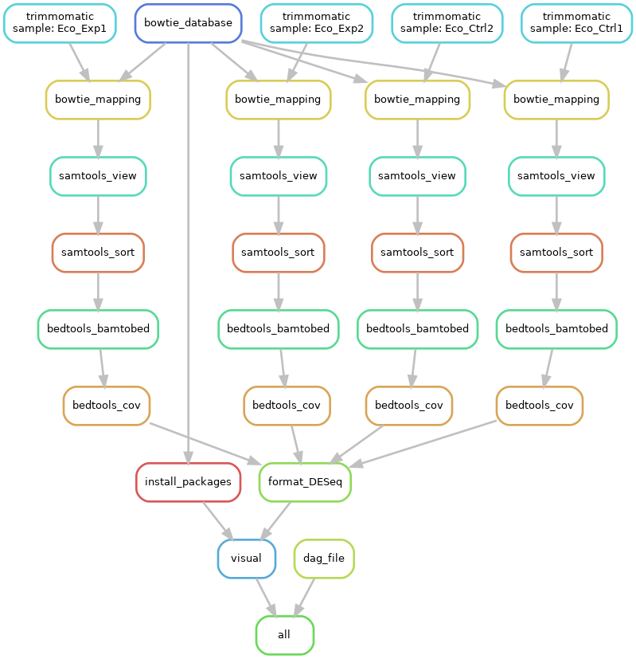
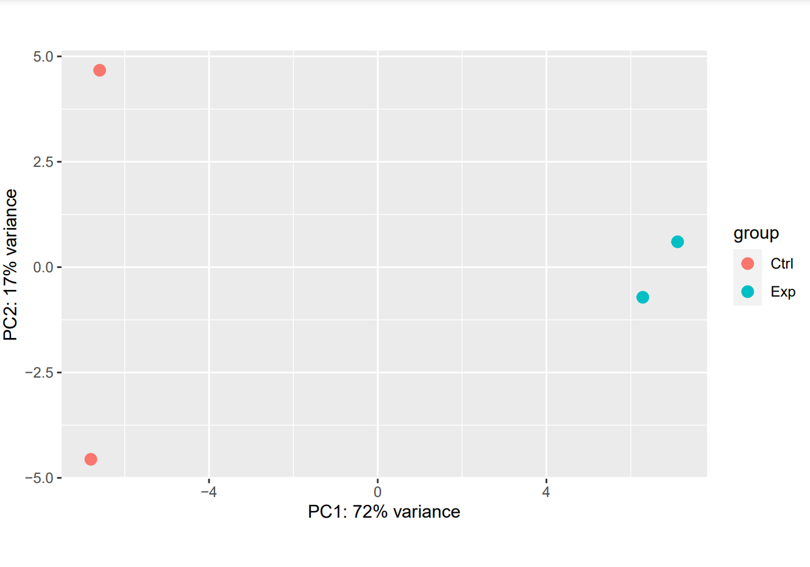

------------------------------------------------------------------------

# Overview

This pipeline creates two visualizations. One visualization is a PCA
plot and the second one is a dendogram/heatmap. But before the
visualizations are created some steps in pre-processing is done.

For more background information look at the article. Link to
[article](https://link.springer.com/article/10.1007/s12275-020-9536-2).

------------------------------------------------------------------------

Overview pipeline:  

------------------------------------------------------------------------

# Computer ready for snakemake

## Collect files

Required files:

-   Download raw sequencing files (.fastq.gz).  
    The number of files depends on your experiment set-up.  
    Locate the desired input files in the raw_reads/ directory.  

-   Download and locate the adapter sequence in trommomatic/adapters/
    directory. (RiboSeq_adapter.fa)

-   Download and locate the reference genome sequence file in
    referenceDB/ directory. (NC000913.3.fa)

-   Find the genome annotation file and download the file in the
    referenceDB/ directory. (NC_000913.3.gff3)

-   The last required file is a design of the experiment and place this
    file in referenceDB/ directory. Fileformat must be in txt.  
    (Design_sheet.txt)

It is possible to use the example files. The files are available in the
example_files directory. You only need them to move them in the correct
directory, mentioned above.

------------------------------------------------------------------------

## Installing snakemake

Required software:

executed on a linux system.

R v4.0.4  
Python v3.9.2

`python3 -m venv {path/to/new/virtual/environment} #create a virtualenv`
 
`source {path/to/new/virtual/environment}/bin/activate #activate the virtualenv`  
`pip3 install snakemake {name}`

------------------------------------------------------------------------

[trimmomatic](http://www.usadellab.org/cms/?page=trimmomatic) v0.39  
Trimmomatic must be placed in trimmomatic/ folder and unzip the binary
file.  
The pipeline needs to know the path to the trimmomatic-0.39.jar file.

------------------------------------------------------------------------

bowtie2 v2.4.2

#### create and go to install directory

`cd $HOME/tools/bowtie2/`

#### download Ubuntu/Linux version

`wget https://sourceforge.net/projects/bowtie-bio/files/bowtie2/2.4.2/bowtie2-2.4.2-sra-linux-x86_64.zip/download`

#### decompress

`unzip download`

#### add location to system PATH

`export PATH=$HOME/tools/bowtie2/bowtie2-2.4.2-sra-linux-x86_64:$PATH`

------------------------------------------------------------------------

samtools v1.11

#### create and go to install directory

`cd $HOME/tools/samtools/`

#### download Ubuntu/Linux version

`wget https://sourceforge.net/projects/samtools/files/samtools/1.11/samtools-1.11.tar.bz2/download`

#### decompress

`unzip download`

#### add location to system PATH

`export PATH=$PATH:/directory/samtools-0.1.11`

------------------------------------------------------------------------

[bedtools](https://bedtools.readthedocs.io/en/latest/content/installation.html)
v2.30.0  
Choose the desired installation.

------------------------------------------------------------------------

## Example output PCA

------------------------------------------------------------------------

# What do rules do?

-   trimmer.smk
    -   **rule trimmomatic:** trims low quality reads and adapter
        sequence.
-   alignment.smk
    -   **rule bowtie_database:** builds reference database.
    -   **rule bowtie_mapping:** mapping reads with Bowtie2.
-   decompiler.smk
    -   **rule samtools_view:** convert from sam to bam files.
    -   **rule samtools_sort:** sort the bam files.
    -   **rule bedtools_bamtobed:** convert from bam to bed files.
-   genome_parser.smk
    -   **rule parse_genome_annotation:** convert the information-rich
        GFF3 file into GFF file.
-   diff_expr.smk
    -   **rule bedtools_cov:** computes both the depth and breadth of
        coverage of features in file B on the features in file A.
    -   **rule format_DESeq:** combines all output files in a single txt
        file.
-   visualize.smk
    -   **rule install_packages:** install the needed R packages to make
        the visualizations.
    -   **rule visual:** create two visualizations. PCA and
        dendogram/heatmap.
-   dag.smk
    -   **rule dag_file:** produce visualization overview pipeline.

------------------------------------------------------------------------

# Contact

e-mail: <l.r.meulenkamp@st.hanze.nl>

# Credits

[Article](https://link.springer.com/article/10.1007/s12275-020-9536-2)  
Fenna Feenstra  
[Snakemake](https://snakemake.readthedocs.io/en/stable/index.html)
